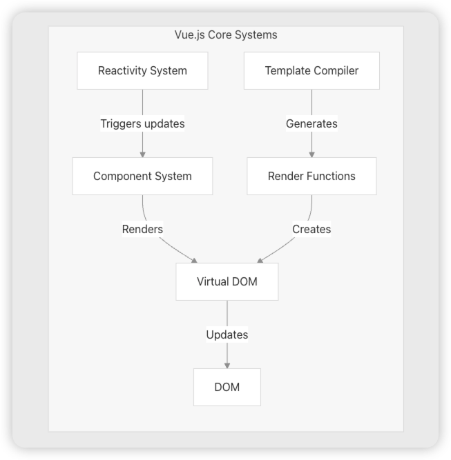

## 概述

Vue.js 由四个协同工作的主要子系统组成：



- 响应式系统 

  响应式系统会自动跟踪 JavaScript 状态变化，并在必要时触发组件更新。

- 组件系统 

  组件系统管理组件的创建、挂载、更新和各个生命周期

- 编译系统

  编译系统把Vue 模板编译成可执行的渲染函数

- 渲染系统

  渲染系统创建vnode，然后patch新老虚拟DOM树，找出变更节点更新 DOM

###  通过一个简单示例讲解整个vue实现原理
::: tip
以下是在脚手架项目中运行的过程，不包括编译运行时
:::

```typescript
import { createApp } from 'vue'
import App from './App.vue'
const app = createApp(App)
app.mount('#app')
```

1. 在打包构建时编译系统把App 组件模版进行编译

   ```vue
   <script setup>
   import { ref } from 'vue'
   
   const msg = ref('Hello World!')
   </script>
   
   <template>
     <h1>{{ msg }}</h1>
     <input v-model="msg" />
   </template>
   
   ```

   主要是生成具有render方法和setup方法的组件模版

   ```js
   /* Analyzed bindings: {
     "ref": "setup-const",
     "msg": "setup-ref"
   } */
   import { ref } from 'vue'
   
   
   const __sfc__ = {
     __name: 'App',
     setup(__props, { expose: __expose }) {
     __expose();
   
   const msg = ref('Hello World!')
   
   const __returned__ = { msg, ref }
   Object.defineProperty(__returned__, '__isScriptSetup', { enumerable: false, value: true })
   return __returned__
   }
   
   };
   import { toDisplayString as _toDisplayString, createElementVNode as _createElementVNode, vModelText as _vModelText, withDirectives as _withDirectives, Fragment as _Fragment, openBlock as _openBlock, createElementBlock as _createElementBlock } from "vue"
   function render(_ctx, _cache, $props, $setup, $data, $options) {
     return (_openBlock(), _createElementBlock(_Fragment, null, [
       _createElementVNode("h1", null, _toDisplayString($setup.msg), 1 /* TEXT */),
       _withDirectives(_createElementVNode("input", {
         "onUpdate:modelValue": _cache[0] || (_cache[0] = $event => (($setup.msg) = $event))
       }, null, 512 /* NEED_PATCH */), [
         [_vModelText, $setup.msg]
       ])
     ], 64 /* STABLE_FRAGMENT */))
   }
   __sfc__.render = render
   __sfc__.__file = "src/App.vue"
   export default __sfc__
   ```

- 创建渲染器    

```typescript
createRenderer(rendererOptions))
```

​	传入的rendererOptions 为平台特定的渲染选项，通过抽离实现跨平台功能

- 调用渲染器创建 一个APP实例

- 调用APP实例代理的mount方法

  - 标准化挂载的容器

  - 调用APP实例真实的挂载方法

    - 根据传入的App组件模版作为type生成vnode

    - 调用渲染器的render方法

      - 调用渲染器的patch方法，因为没有老的vnode，则直接进行挂载组件
        - 创建组件实例
        - 把组件模版定义的props属性放到组件实例的props对象中，其余的放入组件实例的attrs对象中,并且给组件实例的props设置浅响应式shallowReactive
        - 如果组件模版有setup方法
          - 如果模版setup方法参数大于1，则创建setupContext上下文，该对象有组件实例上的attrs、slots、emit、*exposed*属性对象
          - 执行组件模版的setup方法，第一个参数为组件实例的props，第二个参数为setupContext上下文
          - 处理setupResult结果，如果返回的是函数的话，则作为组件实例的render方法，如果是对象的话，则代理这个对象的get和set进行自动引用解包
        - 开始准备渲染组件
          - 新建一个响应式副作用ReactiveEffect，在副作用中进行组件的挂载和更新
          - 执行副作用
            - 执行render函数生成组件内的vnode
            - 在执行render函数过程中触发响应式对象的get拦截，收集依赖
            - 将render生成的vnode传入patch方法递归渲染

## 响应式系统

[在vue3.5的版本中对响应式系统进行了修改，采用了双向链表来提高内存效率](https://github.com/vuejs/core/blob/main/CHANGELOG.md)。

**为什么在内存优化方面起到大作用？** vue3.5之前，Sub依赖的dep是一个集合，每次执行副作用前将集合清空，频繁的集合清空操作，GC也不能立即执行，所以内存释放慢。

[双向链表流程图](https://excalidraw.com/#json=zEKAiSexHftnRhqXN3nFY,Unjksk64uZaFfbyfG-hHew)

### 收集依赖

- 不管是渲染组件还是执行Effect函数都会新建一个reactiveEffect响应式副作用对象，在副作用中收集依赖，以下统一用sub来指代reactiveEffect响应式副作用对象

- 执行副作用

- ***(更新时触发)*** 从前往后遍历当前sub的link节点，把每个link的version设置为-1，为之后清理无效link做准备，保存原先的dep的activeLink到prevActiveLink中，然后把dep的activeLink设置为当前link

- 保存全局activeSub到prevEffect变量中，设置全局activeSub为当前sub，这是为了支持组件嵌套，开始执行，触发响应式对象的get/computed计算属性的get value方法

  - (每一个响应式对象的key属性/或则computed)都会对应一个dep依赖，dep依赖和sub是多对多的关系，通过link的双向链表来存储它们之间的关系

  - 如果dep中activeLink指针没有引用对象，或者当前link在计算属性中使用

    - 新建link存储当前sub和dep，version属性等于dep的version

    - 如果当前sub的deps指针没有引用对象，则当前的sub的deps和depsTail指针指向link(首尾指针)
    - 如果有表示当前sub之前收集过其它的link,则把新建的link挂到最后面，新建的link的prevDep指向由depsTail指针指向的最后一个link，最后一个link的nextDep指向新建的link完成水平方向的双向链接，更新sub的depsTail指针指向新建的link。
    - 如果dep的subs指针没有引用对象，则dep.subs指针指向新建的link
    - 如果有则表示当前dep被上一个sub收集过，把新建的link挂到最后，新建的link的prevSub指向由subs指针指向的最后一个link，最后一个link的nextSub指向新建的link完成竖直方向的双向链接，更新dep的subs指针指向新建的link
    - 如果当前dep是一个计算属性，则要判断是否是首次或则是依赖有更新，是的话才执行，不是直接return
      -  执行计算属性收集依赖
      - 如果dep.version===0(首次执行)或则值变了，设置计算属性的_value为返回值，`dep.version++`
      - 更新link的version=dep.version
      - 返回this._value的值

  - (***更新时触发***)如果dep中activeLink指针引用对象，并且`link.version === -1`
    - 更新`link.version = this.version`
    - 如果link后面还有节点，则把link挂载到最后面，更新`activeSub.deps和activeSub.depsTail`

  - 清理依赖

    - 从当前sub的depsTail指向的最后一个link开始遍历

      - ***(更新时触发)***如果link的version===-1，表示该link在更新时被废弃，需要清理无效依赖，断开nextSub和prevSub指针链接，让其上下的link相连，如果是计算属性，则从其所有依赖中取消订阅，断开nextDep和prevDep指针链接,让其左右link相连

      - 不是的话用head保存当前link

      - 恢复link原先的dep中的activeLink为link.prevActiveLink

      - 恢复完设置link.prevActiveLink为underfined

    - 更新当前sub的deps指针和depsTail指针

  - 恢复activeSub为上一层组件的prevEffect

### 触发更新

- 执行startBatch，全局batchDepth++

- 找到触发的依赖dep,dep的version字段++，globalVersion++
- notify通知各个订阅者
  - 执行startBatch，全局batchDepth++
  - 以subs指针开始倒序遍历，生成2个链表，一个把每个reactiveEffect都插到batchedSub链表的头部，一个把每个computed都插到batchedComputed链表的头部，并且如果是computed的话，每个computed的dep也都会去通知computed的订阅者，然后把订阅者也挂到链上。***每次挂载前都会把当前的sub变更为NOTIFIED，防止重复挂载***
  - 每次通知完执行endBatch，batchDepth--

- 执行endBatch

  - 如果batchedComputed链表存在，清除NOTIFIED状态

  - 遍历batchedSub链表，清除NOTIFIED状态，准备开始执行Effect副作用

    - 以*sub*.deps指针开始顺序遍历，正常通过link的version和dep的version是否相等来判断是否是需要更新，如果是计算属性的话，则递归去找计算属性的sub的link的version和dep的version是否相等来判断是需要更新
      - 如果计算属性的sub的version不相等，则重新执行计算属性，重新执行上面的依赖收集，如果返回值有变化，更新计算属性的`_value`并且` dep.version++`，最后清理计算属性的依赖，和上面一致

    - 计算属性的` dep.version++`后变为需要更新，开始执行副作用和重新收集依赖

### 面试回答

[在vue3.5的版本中对响应式系统进行了修改，采用了双向链表来提高内存效率](https://github.com/vuejs/core/blob/main/CHANGELOG.md)。

**为什么在内存优化方面起到大作用？** vue3.5之前，Sub依赖的dep是一个集合，每次执行副作用前将集合清空，频繁的集合清空操作，GC也不能立即执行，所以内存释放慢。

- 收集依赖

​	每一个响应式对象的key属性都会对应一个dep依赖，dep依赖和副作用是多对多的关系，通过link的双向链表来存储它们之间的关系

执行副作用触发get方法会生成dep依赖，新建link存储当前副作用和依赖，version属性等于依赖的version，如果当前没有link，则副作用的首尾指针都指向link，如果有则把link挂到链表最后，如果当前dep依赖有在上一个副作用中被收集过，同时把link挂到上一个link下面，这样就形成了双向链表,如果是计算属性的话，则执行计算属性，同时计算属性作为副作用并且收集依赖生成link链表

- 触发更新

​	找到触发的dep依赖,dep的version字段++,把dep竖直方向的link链表遍历，生成2个链表，一个是副作用链表，一个是计算属性链表，其中计算属性依赖的副作用也会加到副作用链表中，遍历副作用链表，先查看副作用是否需要更新，遍历副作用中的link的version和dep的version是否相等来看每个副作用需不需要更新，如果是计算属性的话，还需要递归去找计算属性的副作用中的link的version和dep的version是否相等来判断计算属性是否需要更新，如果计算属性需要更新就重新执行，并且计算属性的` dep.version++`。

-  重新收集依赖

  把每个link的version设置为-1，为之后清理无效link做准备，如果又被重新收集的话更新link的version等于dep的version，最后清理依赖，把link的指针都断开，等待GC


## 组件系统

### 组件的异步更新

自定义副作用对象的scheduler函数，每次触发更新的时候执行scheduler函数，把副作用的更新函数放到全局队列中，通过Promise.resolve()把执行队列放到微任务中，同时设置每个组件的更新函数不能重复添加

### nextTick原理

每次组件异步更新完在then方法中添加nextTick函数

## 渲染系统

### vue diff算法

#### 面试回答

##### vue2中diff算法

vue2采用的是双端diff算法

1. 分别在新老children上设置首尾指针
2. 在while循环中开启比较，分别进行【头部、头部】、【尾部、尾部】，【头部、尾部】、【尾部、头部】4次比较，如果key相同，则patch打补丁
3. 在理想情况下，都能有一端处理完，如果老children还有剩余，则批量卸载，如果新children还有剩余，则批量挂载
4. 在非理想情况下，首尾指针都不一致，则遍历老children查找是否存在有和新元素相同的key值的元素，如果存在则先patch打补丁，然后移动到头部，如果找不到则直接挂载到头部

##### vue3中diff算法

1. 开启while循环预处理新旧children的前置和后置节点，如果key相同，则patch打补丁更新节点

   ::: details

   细节，头部指针都用j遍历，指到不一致为止，因为长度可能不同，尾部用2个指针遍历，newEnd和oldEnd

   :::

2. 在理想情况下，都能有一端处理完，如果新的children有剩余，则挂载新节点,如果旧children有剩余，则卸载旧节点

3. 在非理想情况下，首先找出哪些节点需要移动，按剩余新节点数组大小创建source数组，用来存储新元素在旧children的索引位置，没有则为-1，并且判断新节点在原来老children中是否单调递增

   ::: details

   细节，先遍历没处理完的新children节点，生成map，然后遍历没处理完的老children节点，如果在map中存在，则patch打补丁更新，并且把在老节点中的索引放到新节点source数组中，如果不存在则卸载，同时判断新节点的顺序是否保持和老节点一样单调递增，通过一个pos字段来保存老的位置索引，每次遍历时如果比pos小则表示需要移动，然后更新pos字段

   :::

4. 如果有单调递增，则说明要移动节点，根据source算出最长递增子序列在source中的索引数组，子序列中的节点不需要移动,for循环遍历移动元素和挂载新节点

   ::: details

   使用双指针来遍历source数组和最长递增子序列，i指向最长递增子序列的最后一个位置，j指向source最后一个，从后向前遍历，如果是-1，表示新增，直接挂载，如果在最长递增子序列中，则不做任何处理，都不是的话移动元素

   :::

   

### vue3最长递增子序列算法

### 面试回答
1. 动态规划，遍历数组，
2. 通过二分查找+贪心算法找到每一个的局部最优解
3. 回溯修正

### vue3 key关键字的作用

### 面试回答
1. key关键字主要是用在diff算法中，用来精确的查找新旧children节点数组中是否存在相同的节点，如果有就复用节点
2. 如果元素节点key不同则会在patch时直接卸载节点

## keepAlive组件的实现原理
作用:
keepalive组件可以避免一个组件被频繁的销毁和重建
原理：
是从原容器搬运到另外一个隐藏的容器中，实现假卸载

1. 在setup函数中构建一个map对象来缓存要被keeplive的组件vnode,vnode中有要被组件的实例、真实的DOM元素
2. 创建一个不挂载的元素来接收要被缓存的真实DOM，在keepalive组件实例上注入2个生命周期的回调，deActivate和activate用来隐藏和显示真实DOM元素
3. 当keepalive组件是动态插槽时，有响应式数据更新，keepalive的render函数会重新渲染，从缓存map中获取vnode,如果存在，则把组件实例放到插槽中的vnode中，并标记改vnode为keptAlive，避免渲染器重新挂载它，不存在就缓存它
4. 当卸载时调用调用父组件keepAlive实例上的deActivate回调钩子把节点移动到隐藏容器中，当重新挂载是父组件keepAlive实例上的activate回调把节点移回原来的容器

## 单文件组件 CSS scope 原理

它的实现方式是通过 PostCSS 将 类选择器转化为类+属性选择器，属性进行哈希处理，但是子组件的根节点会同时被父组件的作用域样式影响,你可以直接在父组件上写类选择器，这样设计是为了让父组件可以从布局的角度出发，调整其子组件根元素的样式。

### 深度选择器

```vue
<style scoped>
.a :deep(.b) {
  /* ... */
}
</style>
```

上面的代码会被编译成：

```vue
.a[data-v-f3f3eg9] .b {
  /* ... */
}
```

### 全局选择器

如果想让其中一个样式规则应用到全局，比起另外创建一个 `<style>`，可以使用 `:global` 伪类来实现 (看下面的代码)：

```vue
<style scoped>
:global(.red) {
  color: red;
}
</style>
```

### CSS Modules

作用和css scoped一样,一个 `<style module>` 标签会被编译为 [CSS Modules](https://github.com/css-modules/css-modules) 并且将生成的 CSS class 作为 `$style` 对象暴露给组件：

```vue
<template>
  <p :class="$style.red">This should be red</p>
</template>

<style module>
.red {
  color: red;
}
</style>
```

自定义注入名称

你可以通过给 `module` attribute 一个值来自定义注入 class 对象的属性名：

```vue
<template>
  <p :class="classes.red">red</p>
</template>

<style module="classes">
.red {
  color: red;
}
</style>
```

与组合式 API 一同使用,显示声明导入

```vue
<script setup lang="ts">
import { useCssModule } from 'vue'

const classes = useCssModule()
</script>

<template>
  <p :class="classes.red">red</p>
</template>

<style module>
.red {
  color: red;
}
</style>
```

### CSS 中的 `v-bind()`

可以在css中动态设置样式属性

实际的值会被编译成哈希化的 CSS 自定义属性，因此 CSS 本身仍然是静态的。自定义属性会通过内联样式的方式应用到组件的根元素上，并且在源值变更的时候响应式地更新。就是说在根元素上定义变量，然后再通过var来加载变量

## vue2 和vue3有哪些不同

### 响应式系统

1. 响应式原理

   - vue2基于Object.defineProperty实现，需要递归遍历对象属性进行劫持

     局限性:无法监听对象属性的新增和删除、数组索引的变化，同时性能不好

   - Vue3 改用Proxy代理数据，直接监听整个对象，支持动态属性增删，Map、Set等复杂类型

     在return 返回时再进行响应式处理，性能更好

2. API设计层面

   Vue3 参考react引入了Composition API和setup函数，提供了逻辑代码复用的能力

3. 在响应式原理方面

   [在vue3.5的版本中对响应式系统进行了修改，采用了双向链表来提高内存效率](https://github.com/vuejs/core/blob/main/CHANGELOG.md)。

### 编译系统

**编译优化**：静态节点提升、动态属性缓存，减少 Diff 计算

### 渲染系统

Diff 算法变更，在vue2采用双端diff算法，而在vue3则采用了最长递增子序列优化算法

### 组件系统

对组件的生命周期进行了修改

### 其它

Typescript友好
